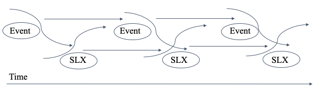

```{r setup, include = FALSE}

# clear the workspace
rm(list=ls())

# install and load required packages
source('./scripts/required_packages.r')
source('./scripts/libraries_and_functions.r')

# turn on caching
knitr::opts_chunk$set(cache=TRUE, autodep=TRUE, cache.lazy=FALSE)

# create subdirectories
dir.create("./data/raw") # load three data files here
dir.create("./data/formatted/primary", recursive = TRUE)
dir.create("./data/formatted/secondary/icews", recursive = TRUE)
dir.create("./data/formatted/secondary/phoenix", recursive = TRUE)
dir.create("./results/primary/crqa", recursive = TRUE)
dir.create("./results/primary/windowed-crqa", recursive = TRUE)
dir.create("./results/secondary/icews/crqa", recursive = TRUE)
dir.create("./results/secondary/icews/windowed-crqa", recursive = TRUE)
dir.create("./results/secondary/phoenix/crqa", recursive = TRUE)
dir.create("./results/secondary/phoenix/windowed-crqa", recursive = TRUE)

```

```{r data-prep, echo=FALSE, warning=FALSE, message=FALSE, error=FALSE, results='hide'}

# format the data
source('./scripts/primary-analyses/01_formatting_data.R')

num_target <- sum(ICEWS_formatted_target$all_events_target)
num_source_target <- sum(ICEWS_formatted_source_target$all_events_source_target) 

```

Before social media, people coordinated protests using phone tree calling sheets
and mimeographed flyers, through in-person meetings of social organizations and
churches, and by word of mouth. They gathered together and hand-made protest
signs that reflected their agendas. As McAdam found, people were more likely to
join movements when they had a personal connection [@mcadam1986recruitment;
@mcadam1993specifying]: Historically, strong ties have been strong predictors of
involvement in high-risk protest activity.

The cohesiveness and strength of social movements before the Internet were
operationalized by the number of people present and through the political events
that precipitated and resulted from social gatherings *en masse*. Cohesive
social movements were reflected in their cohesive placards and posters. For
example, the pervasive “I am a man” posters during the 1968 Memphis sanitation
workers' strike reflected their internal cohesion and unified, goal-oriented
movement [@Windsor2020].

However, the rise of the Internet and its decentralized online networks have
upended theories about recruitment to---and participation in---social movements.
Strong interpersonal ties have yielded to weak impersonal ties that strongly
predict involvement in social movements [@steinert2017spontaneous]. Measurements
of social movements have similarly evolved from ethnographic interviews to “big
data” analyses of social media.

Amid the cacophony of messages during political upheaval---such as the Arab
Spring of the early 2010s---consistent themes emerge through hashtags, retweets,
and the repeated mentions of concepts such as regime, demonstration, and human
rights. The cohesiveness of these themes (i.e., the degree to which participants
in the movement are metaphorically singing in one voice) reflects the real-world
events happening contemporaneously with collective action in social movements or
civil conflicts.

In the present research, we investigate the relationship between linguistic
cohesion and social cohesion in times of social conflict and unrest. We tackle a
question related to the one posed by Zeitzoff [-@zeitzoff2017social]: How does
social media reflect on-the-ground realities during times of social conflict? To
do so, we examine patterns of linguistic cohesion on Twitter and their
connection to real-world events during the Arab Spring uprising in Syria between
March and June 2012.

Disentangling the complicated relationship between mass online
mobilization---and social mobilization in person---continues to be relevant,
even as our modes of communication change. Accordingly, the political events
around the Arab Spring are still being understood. As Zeitzoff
[-@zeitzoff2017social] recognizes, social media is changing conflict, but the
mechanisms and relationships by which it does so are still largely unknown.

## Syria in Context
The decades preceding the Arab Spring in Syria were marked by repression and
fear. In 1971, Hafez al-Assad overthrew the previous leader and remained in
power for thirty years, presiding during regional contentiousness and
cooperation until his death in 2000. His son, Bashar al-Assad, continued the
regime of authoritarian leadership after assuming his office. The Assad lineage
hails from a minority Islamic sect (the Alawites) in a multi-religious and
multi-ethnic country comprising Christians, Sunni and Shia Muslims, Kurds, and
Palestinian refugees.

In December 2010, a Tunisian man named Mohamed Bouazizi died after setting
himself on fire to protest the authoritarian government’s unjustifiable
confiscation of his vendor cart by municipal officials. His actions served as a
catalyst for the Tunisian Revolution, which rapidly spread to surrounding
countries also subject to unjust authoritarian rule, including Egypt, Libya, and
Syria.

Following a wave of democratization efforts across the Middle East and North
Africa, modest Syrian protests began in March 2011. The regime responded harshly
with imprisonments, detentions, censorship, and military operations as the
resistance to Assad's regime spread. The fighting escalated dramatically in
March 2012, after increased unrest in the western city of Homs. International
actors---including the Red Cross/Red Crescent Society, the United Nations
General Assembly, the U.N. Security Council, and individual world
leaders---worked toward cease-fires, negotiations, and concessions without much
success. While many high-level military and diplomatic officials defected,
numerous loyal forces continued the regime's repression, and the Syrian people
turned to social media to coordinate their activism and communicate to the
world. Between March and June 2012, millions of tweets were sent within Syria,
revealing the details of the conflict suppressed by the government. A full
account of the history of the Arab Spring is outside of the scope of the current
article; more information can be found in [@brownlee2013syria] and
[@lynch2016new].

Syria is a multi-ethnic, multi-lingual, and multi-religious state. Kurdish
people make up between 10-15% of the population, Alawites between 8-15%, and
Christians about 10%. There are also much smaller sects (e.g., Ismailis, Druze),
but Sunni Muslims comprise the vast majority of society. Most people speak
Arabic as their primary language. Most policy reports addressing the current
conflict report on the cohesion of the ruling Alawite military elite, rather
than on the cohesiveness of the opposition movement. However, the Sunni
majority's disaffection with the Syrian government and their lack of political
representation provide sufficient grievance and collective group identification
to make them a cohesive force.

## Social Media and Social Movements
Massive online social cohesion can manifest in real-world social behavior.
Social media platforms enable online social cohesion by offering distributed
information-gathering and real-time information dissemination. Given its
accessibility and proficiency as an information exchange tool, Twitter has
provided social and political activists an opportunity to complement
[@greijdanus2020psychology] and not hinder participation in
[@harlow2012collective; @milovsevic2017civic] real-world social mobilization.
During the 2012 Italian protests for global economic change, tweeting was
determined to be more effective locally in discussing real-world, real-time
events than traditional mainstream media platforms [@vicari2013public]. As
people increasingly rely on social media for local news and information, we must
understand exactly how these micro-blogs connect to and reflect real-world
action.

Along with Facebook, Twitter has been credited as essential to the Arab
Spring---both for protesters and for the government's response to them
[@comninos2011twitter]. The Arab Spring has been deeply examined within the
political science literature [e.g., @lutterbeck2013arab;
@koehler2017political], but to our knowledge, the direct *coupling* between
Syrian Twitter cohesion and international action has not been investigated
(though hashtag usage has been linked to next-day protests;
@steinert2015online). In fact, some have been skeptical about the effect of
social media on collective action at all [@seay2014slacktivism].

This skepticism is summarized in a quote by Lisa @anderson2011demystifying:

\setlength{\leftskip}{1cm}

\noindent The important story about the 2011 Arab revolts in Tunisia, Egypt, and
Libya is not how the globalization of the norms of civic engagement shaped the
protesters' aspirations. Nor is it about how activists used technology to share
ideas and tactics. Instead, the critical issue is how and why these ambitions
and techniques resonated in their various local contexts. (p. 2)

\setlength{\leftskip}{0pt}

\noindent Others have similarly expressed hesitation about the role of online
organizing. Some have argued that real-life strong ties outweigh online weak
ties and that the power of the strong ties through in-person contact is critical
to recruiting people for higher-risk activities [@gladwell2010revolution;
@mcadam1986recruitment].

Interestingly, these views may help make the case for bridging social media and
social mobilization. Such views suggest the strength of online social ties is
inextricably linked to the *context* and *ambitions* of the actors. Moreover,
research suggests that weak ties still retain considerable political power:
While strong ties tend to bind smaller groups, weak ties tend to bind groups
across distances [@granovetter1977strength].

Social media generates critical information about events, including whether and
how a demonstration will take place, how many people participate, and how those
in power (e.g., state, military) respond. Similarly, these media platforms alert
us to more global shifts within a conflict, such as when fighting moves to a new
city or region, the number of casualties and wounded, and the types of weaponry
used by parties [@zeitzoff2017social]. In monitoring social media channels,
government forces may respond to the perception that citizens are gaining
strength and sympathy. Governments have been shown to be quite tolerant of
dissent so long as it does not metamorphose into collective action
[@king2013censorship].

Protestors and social activists communicate with each other with increased
transparency due to the ubiquitous availability of social media like Twitter.
Activists are able to access these tools via mobile phones and computers with
Internet connectivity, providing a stream of real-time shared information.
Citizens can share the location of events like protests and military incursions,
the degree of state repression, and the number of casualties. In turn, the
government---interested in remaining in power---monitors social media platforms
to ascertain emerging threats [@comninos2011twitter], such as where new groups
are forming, where existing groups are strengthening, where gatherings are held,
and who the leaders are.

With few exceptions, leader Bashar al-Assad chose to keep social media platforms
up and running. Gohdes [-@gohdes2015pulling] notes that regimes can attempt to
thwart the growth of social protest online and in the streets by shutting down
the Internet. During these times, military repression increases, but government
information about the citizens decreases. As a result, regimes may elect to
maintain Internet connectivity to monitor and surveil their citizens.

At the same time, the insulation of online social platforms allows researchers
to detail real-world social dynamics at unprecedented resolution and scale
[@paxton2017finding]. The digital traces left by individuals and collectively as
groups are regarded as a valuable source of information that can offer powerful
insights into states of social disequilibrium, uprisings, and escalations into
civil wars. By examining these conversations, researchers can study the degree
of cohesion between speakers and the alignment between that cohesion and their
collective political behavior, just as the degree of cohesion among real-world
protestors in past movements has been captured in their shared sign messaging
[@Windsor2020].

## The Role of Cohesion in Social Movements and Civil Wars

People join social and political resistance movements because they feel a sense
of connection to the cause. Given that people are generally risk-averse,
overcoming inertia requires a strong connection to the group identity or a
strong aversion to an individual, event, or political injustice
[@goldstone1980theories; @goldstone2011understanding]. Political resistance
offers participants the opportunity to “lose themselves” and relinquish their
individual identity in favor of identification with a larger group, contributing
to a cohesive group ready and mobilized for action [@Hoffer2011true].

The type of collective contentious behavior that manifests in society is a
function of the available political opportunity structures. The political
opportunity structure is “comprised of *(sic)* specific configurations of
resources, institutional arrangements and historical precedents for social
mobilization, which facilitate the development of protest movements in some
instances and constrain them in others” [@kitschelt1986political, p. 58].
Emergent strategies and tactics in contentious politics are a function of what
the system makes possible. This includes the number of people and their
disposition (i.e. nonviolent or violent), as well as their internal structure.
The more cohesive a group is, the greater threat they pose to the establishment.

Cohesion is a familiar concept in the study of civil conflicts, as it pertains
to group affiliation and the ability to overcome collective action problems.
Individuals must act in concert---that is, cohesively---to accomplish the task
of challenging state authority [@olson1965logic;
@eisinger1973conditions; @tilly2004contentious; @francisco1995relationship].
Viewing rebel recruitment during civil conflicts as a function of internal
cohesion, rebel movement success is influenced by the degree of group cohesion,
which itself is a function of geographic distance, ideology, and ethnicity
[@gates2002recruitment]. Within Syria, multiple rebel groups exist, sourcing
fighters locally (from the disaffected Syrian population) and internationally
(from transnational terrorist organizations). Groups compete intensely with one
another for recruitment in the rebel movement and often punish defectors for
nonparticipation [@gates2002recruitment].

Another factor influencing social cohesion during social movements and civil
wars is ethnic identity and the degree of ethnic conflict associated with the
movement. Greater degrees of ethnic conflict increase the salience of ethnic
identity, leading people to identify more strongly with their own ethnic
identity [@sambanis2009s]. As ethnic conflict intensifies, groups seek to become
more quintessentially like the typical member of their ethnic group. This can
manifest in a number of ways, including in behavior on social media. However,
this may also include a general identification across ethnic groups in a
membership of an opposition to an oppressive leader.

The civil war literature has also explored the role of social cohesion. Social
homogeneity increases the likelihood of social conflict, especially when the
society is polarized [@collier2004greed]; this is partly due to nationalist
groups' strong identification with a collective identity [@cederman2007beyond]
and their social solidarity [@sambanis2009s]. These same processes can be
similarly important for rebels [@anyanwu2002economic]. Referencing Gurr's
[-@gurr2000peoples] work on minorities at risk, Regan and Norton
[-@regan2005greed] note that

\setlength{\leftskip}{1cm}

\noindent a religious or linguistic minority might suffer disproportionately in
a given society, and this form of aggrievement can lead to unrest across the
social lines that distinguish the minority group. Therefore, while collective
cohesion is a function of targeted maldistributions, it is individual penury
that allows for this collective mobilization. (p. 323)

\setlength{\leftskip}{0pt}

The body of previous work concurs that group cohesion matters to group
mobilization. We build on this by providing a quantitative approach to
understanding cohesion from multiple levels and by incorporating analytic tools
that allow us to investigate the interconnectedness of those levels.

## Cohesion: A Multi-Leveled, Multi-Layered Concept

We contextualize linguistic cohesion with social mobilization and response to
the relative intensity of the conflict. Cohesion is a multi-layered concept
referring to the connectedness of speakers, actions, and societies. It reflects
the continuity of language and expression and shows the connectivity of
participants in a social movement. To address the relationship between language
and discourse and social movements, we adopt an interdisciplinary approach that
incorporates linguistics, psychology, and political science using nonlinear
dynamical systems methodology to disentangle the relationship between language
and action.

### Lexical and Interlocutor Cohesion

Just as real-world social cohesion can be quantified, so can online cohesion.
One kind of cohesion is the similarity in language use on social media. This
implicit or explicit similarity can indicate shared beliefs, thoughts, and
feelings, as has been studied in research on language style in psycholinguistics
and social psychology [@gonzales2010language;
@tausczik2010psychological;
@brennan1996conceptual]. Although previous work on language style has often
focused on individuals and small groups, this can be scaled up to examine
massive social-level changes [@michel2011quantitative; @fusaroli2015timescales].

The first level of cohesion that we will consider are the words within social
media posts.  In Fig \@ref(fig:cohesion-in-tweets), we see four sequential
tweets of four words each. Each sequential tweet contains some content included
in the previous tweets. The linguistic construct of content word overlap
measures the relationship across units of meaning---here, tweets---where
identical and semantically similar words are repeated [@graesser2004coh]. These
repeated lexical items constitute a theme; on Twitter, this might be a
particular hashtag, a name, a location, or another nominal category. This
localized cohesion is referential; words are repeated and co-referred across
tweets, creating a sense of continuity and cohesiveness.

[Fig \@ref(fig:cohesion-in-tweets) about here]

Typically, these analyses focus on *content words* (e.g., nouns, adjectives,
verbs), which convey more meaningful semantic information than *function words*
(e.g., articles, conjunctions). While function words can provide important
information about complexity and language structure
[@tausczik2010psychological], content words have more specialized meaning and
are therefore more useful when researchers want to understand *what* people are
discussing, rather than *how* they are discussing it [@graesser2004coh;
@mcnamara2014automated].

In estimating cohesion in Twitter posts, tweets that share content words yield
higher cohesion values, even among speakers with opposing views on the subject
matter. Repetition of terms and concepts is captured by reiteration, which is a
type of lexical cohesion in which a subsequent item repeats a previous item, or
refers to it through synonymous language [@halliday1976cohesion]. We include
retweets (i.e., reposts or forwards of previous messages) because they are a
form of reiteration that increases message cohesion. They indicate that
individuals are “singing to the same tune” by amplifying the original message.
Since retweets replicate verbatim another tweet (sometimes with the addition of
commentary or supplementary messages), these tweets would also have higher
cohesion.

```{r cohesion-in-tweets, echo=FALSE, warning=FALSE, message=FALSE, error=FALSE, fig.cap = "A visual representation of cohesion in tweets. The shared content words--either identical or semantically similar--constitute a theme around which cohesion is occurring.", out.width='100%'}

# call the image


```

We also include hashtags in our analyses. Hashtags are a way of identifying
similar topics (e.g., people, events, places, themes) across users and across
tweets by typing a string of characters preceded by a “#” symbol. Users may
choose to include as many hashtags (up to the total character limit of the
tweet) as they would like, and they may choose to create their own or adopt
hashtags from other users or groups. The use of the same hashtags would increase
cohesion; however, because hashtags are often included or embedded within longer
messages, simply using the same hashtags would not be a guarantee of higher
cohesion if the rest of the words in the tweets do not overlap.

The use of similar language can provide insight into *interlocutor cohesion*, or
the degree to which people are talking about similar things. This can include
people who are talking about similar things from radically perspectives, as well
as those who are talking about something from the same perspective. Previous
research from political science has investigated these ideas [@Windsor2020]: The
“Occupy Wall Street” movement has been held up as an example of a movement with
low interlocutor and linguistic cohesion because of its wide range of signs and
slogans, while the “I am a man” protest (during the 1968 sanitation workers'
strike in Memphis, TN) or the “Black Lives Matter” placards (following the
uprising in Ferguson, MO) have high lexical and interlocutor cohesion
[@edgar2018struggle].

Fed by lexical cohesion, interlocutor cohesion ebbs and flows, contextualized by
changing real world events. Interlocutor cohesion may increase preceding an
in-person social mobilization event, alerting a repressive government that
collective mobilization is happening. It may also respond to exogenous events
such as spontaneous, unprovoked militarized conflict.

Given the importance of lexical and interlocutor cohesion for messaging in
political movements, lexical cohesion may be important trace data for
researchers interested in leveraging social media data to analyze social
movements. Similar to large-scale studies of sociocultural movements [sometimes
referred to as *culturomics*; e.g., @michel2011quantitative], political
scientists can track the ways in which conversations on social media coalesce or
diffuse around similar content words. In this way, it matters relatively little
whether the interlocutors have precisely the same views: The point is to
understand whether the society-level conversation is converging on similar
themes.

### Social and Political Cohesion

Real-world collective action is known to bring about a sense of togetherness,
also known as “collective effervescence” [@durkheim1995elementary]. This feeling
of being a part of something larger than oneself leads individuals to act in
ways that would not have on their own. Being overcome with this feeling can lead
to violence [@collins2009violence; @spaaij2014sports]. Conversely, increased
exposure to violence can result in positive social cohesion. @gilligan2014civil
found that exposure to fatal wartime violence resulted in increased prosocial
motivations, including cooperative behaviors, feelings of trust, and overall
community-level social cohesion.

At the same time, behavioral similarity in certain contexts has been connected
to important psychological and social effects. For example, shared language is
associated with rapport [both in face-to-face and computer-mediated
conversations; @niederhoffer2002linguistic; @riordan2011evidence] and can even
be connected to better performance on shared tasks [as long as the language is
relevant to the task at hand; @fusaroli2012coming]. Shared movement is
associated with greater group bonding and greater willingness to contribute to
the group [@wiltermuth2009synchrony], and shared identity leads to a greater
willingness to adopt the group's goals and motivations [@walton2012mere].

We expect to see increased linguistic cohesion among people participating in
online discussions about an idea, event, individual, or movement. While the
overall frequency of social media messages related to the event may increase as
a result of the event, their linguistic cohesion helps us understand if denizens
are using the platforms in a coordinated way that amplifies their messages or
goals and creates a virtual protest space. Given that Syrian protesters
coordinated their activity through Twitter by discussing their own events (e.g.,
planned protests, active demonstrations) and their reactions to events happening
around them (e.g., government reactions, international action or inaction), the
cohesion in social media should correlate with the social cohesion of the group
[@zeitzoff2011using].

Political and social cohesion in the world can be modeled using event data which
encodes who does what to whom on a given day. The CAMEO (Conflict and Mediation
Event Observations) coding scheme encodes a set of activities with numerical
values, rescaled to reflect a conflict-cooperation scale [@schrodt2006twenty;
@goldstein1992conflict]. These event codes include a range of behaviors of
varying intensities and valences, from making public statements and appeals to
demanding, threatening, protesting, and using unconventional mass violence.

Social cohesion can have real and wide-ranging impacts on a political movement
and the people in it. A socially cohesive group is inherently more threatening
to the existing regime because it reflects momentum in collective opposition and
the professionalization of alternate leadership. Global insurgency movements
exhibit similar patterns in their social structure [@bohorquez2009common].
Rather than patchwork messages via Twitter, emergent or intentional cohesive
online messaging---using similar language, paralleling in-person messaging
[@Windsor2020]---demonstrates increased organizational structure, inciting a
government response.

Thus, lexical and interpersonal cohesion are hypothesized to be tied to social
and political cohesion. Shared online language may lead to the development or
expression of shared identity [@wiltermuth2009synchrony]. This, in turn, may
drive individuals' propensity to engage in coordinated behavior for the group
[@wiltermuth2009synchrony; @walton2012mere]. Taken together, these processes may
increase movement participants' weak and strong ties [@granovetter1977strength;
@gladwell2010revolution;
@mcadam1986recruitment], building the movement by expanding and deepening
heterogenous ties. Therefore, during social conflict, the linguistic cohesion of
the online conversation should correspond to the degree of social cohesion on
the ground.

Steinert-Threlkeld [-@steinert2017spontaneous] modeled a similar relationship
between social media and social mobilization alongside event data. That
groundbreaking work demonstrated that participants on the fringe of a social
movement contribute substantially to the overall level of protest. Here, in
addition to providing new methods to this area, we build on this work by
demonstrating how sociolinguistic cohesion evolves in tandem with negative and
positive exogenous events.

### Sociolinguistic Cohesion: Connectedness of Speakers, Ideas, and Events
We tie the constructs of lexical, interlocutor, and social cohesion together in
a theoretical framework called *sociolinguistic cohesion*, as shown in Fig
\@ref(fig:theoretical-framework). Previous values of linguistic cohesion should
influence future values of linguistic cohesion and future actions in the real
world space. Previous events influence future events and future linguistic
cohesion in social media.

[Fig \@ref(fig:theoretical-framework) about here]

Sociolinguistic cohesion is not a static concept. Just as social movements
experience increased participation and setbacks---indicating dynamic
relationships among participants and between participants and the sociopolitical
environment---sociolinguistic cohesion is also dynamic, reflecting the changing
states of the political sphere. Other scholars have noted the diffusion of
messages that reach critical mass, allowing for “behaviors, beliefs, and
preferences” to spread within a population [@barash2012critical]. Cohesion
changes over time in response to external events and the internal dynamics of
the social movement, even if the social interaction occurs entirely online
[@centola2007complex].

Lexical cohesion, then, is a useful indicator of social cohesion in political
crisis. Lexical cohesion happens at the word level. Interlocutor cohesion
happens between speakers. Political cohesion happens at the social level during
moments of political crisis, like civil wars and social movements.
Sociolinguistic cohesion comprises lexical, interlocutor, and sociopolitical
events, in which the words and their context reveal the disposition of socially
connected linguistic communities. It accounts for the cohesion between multiple
speakers in an environment as their language becomes more similar.
Sociolinguistic cohesion also addresses how groups involved in political
rebellion converge to mount sustained resistance to state authority.

Related previous work has also explored diffusion of hashtags in viral contagion
in Nigeria, a phenomenon similar to what we identify as sociolinguistic cohesion
[@fink2016complex]. The prevalence and rate of particular hashtags contributed
to the overall sociolinguistic cohesion. The more that people reuse hashtags or
common phrases, the greater the sociolinguistic cohesion when this phenomenon
occurs during socially significant times like protests [@state2015diffusion].

Combining these separate threads, it is reasonable to expect that real-world
actions and online social interactions would be enmeshed, driving and being
driven by one another. From a dynamical systems perspective, online social
cohesion and in-person action can be considered two complementary components of
a single system--constantly constrained by, interacting with, and influencing
one another [@mahner1997foundations]. Investigation of the coupling of
real-world mobilization and social cohesion could provide new insight into the
power of social media during mobilization and the ways in which individuals
utilize it to bring about, or respond to, social change. Increasingly, social
media platforms are being utilized during social mobilization
[@mcadam2003dynamics;
@koopmans2004movements], but the relationship between virtual and real-world
mobilization is still largely unknown. The present work aims to understand how
physical and virtual movements coexist and interact from a dynamical systems
perspective.

```{r theoretical-framework, echo=FALSE, warning=FALSE, message=FALSE, error=FALSE, fig.cap = "The theoretical framework for sociolinguistic cohesion. Real-world events and linguistic cohesion continually interact and influence one another throughout time.", out.width='100%'}

# call the image


```

## Using Nonlinear Methods to Capture Complex Relationships
Given the hypothesized interrelationship between the real-world and online
actions---and the notorious messiness of naturally occurring data---it is
critical to find appropriate analysis tools that can identify the complex
interconnections. Traditional linear analyses have led to many notable
discoveries in the domains of psychology and political science, but time series
data pose problems that are not easily overcome with these methods. Events have
historically been conceptualized as linear chains of smaller, sequential events
with one occurrence leading to the next. Certain kinds of data are relatively
well-suited to these analyses, but messy, complex, variable data from real-world
events can pose challenges, from overpowered samples to violation of underlying
statistical assumptions [@paxton2017finding].

At the same time, the foundational theoretical assumptions of a linear world
have been increasingly replaced by ideas from dynamical systems theory. Rather
than a chain of events, time series data can be thought of as nested
occurrences, where mutually constrained parts (e.g., citizens, governments,
real-world events, social media platforms) are constantly interacting, leading
to more global behaviors that are larger than the sum of the parts
[@turvey2018lectures]. When analyzed as dynamical systems, many phenomena
exhibit new nonlinear patterns that were formerly overlooked. Nonlinear methods
provide means for capturing the rich temporal dynamics and variability that
unfold in time series data.

Although a number of other nonlinear methods exist, the primary nonlinear
methods used in the current work are cross-recurrence quantification analysis
[CRQA;
@zbilut1998detecting] and its offshoot, windowed cross-recurrence quantification
analysis [WCRQA; @webber2005recurrence]. CRQA has successfully been used to gain
a better understanding of many complex human phenomena, including a variety of
human social interactions [for a review, see @fusaroli2014analyzing]. Much as it
has for psychology, we argue that the use of nonlinear methods in the
investigation of political science phenomena will lead to new insights and the
development of more robust theories.

## The Present Work
Social media has become a primary platform for social movements and activism
across the world, but the extent to which virtual activism reflects and drives
real-world mobilization is still largely unknown. In the current work, we
conceptualize the physical and virtual movements as a dynamical system, both
constantly interacting with and influencing the other. We aim to study this by
analyzing the real-world events and online social cohesion during nearly three
months of the Arab Spring. Both real- and virtual-world collective coordination
were powerful tools in the events of the Arab Spring and are undeniably linked.
This study aims to explore the dynamics of Twitter users in Syria, who used the
social media platform to raise awareness about the Arab Spring and the
relationship of those messages to mass mobilization in the real world.

Using cross-recurrence quantification analysis [CRQA; @zbilut1998detecting] and
windowed cross-recurrence quantification analysis [WCRQA;
@webber2005recurrence], we analyzed the co-evolution of social cohesion online
and real-world events. Specifically, using heterogeneous data from March 30,
2012, to June 15, 2012, we compared the social cohesion of Syrian tweets with
the counts of all, positive, and negative real-world events derived from
international event data [i.e., the Integrated Crisis Early Warning System;
@DVN/28075_2015].

We hypothesized that the count of all events and the count of negative events
would show high levels of determinism, as this time period was marked by daily
violence which often leads to increased salience. We also hypothesized that the
count of positive events would not show patterns of determinism, as these events
were likely overshadowed by the salient negative daily occurrences. After
testing these hypotheses, we then conducted exploratory analyses to further
examine the patterns identified with CRQA. Using WCRQA, we sought to identify
shifts in the dynamics of the systems that could then be linked to real-world
shifts in conflict frequency. Through these analyses, our two primary goals in
the current work were to uncover (1) how different intensities during times of
turmoil may enhance or deter social cohesion in social media communication and
(2) how social mobilization may be evident in the dynamic coupling of cohesion
and real-world events.

An additional focus of the current work is to introduce cross-recurrence
quantification analysis---a longstanding method from physics that has since
become influential in a variety of other fields---to political science. We do so
by providing detailed descriptions of the methods and providing clear directions
about interpretation and significance testing even with relatively small-*n* or
case studies. After demonstrating these methods' utility with this dataset, we
close the paper with specific suggestions to political scientists interested in
these methods.

This work is a reproducible manuscript. Code and analyses can be found at:
www.github.com/mchiovaro/arab-spring.

# Method
## Materials
### Tweet Corpus

```{r corpus_stats, echo=FALSE, warning=FALSE, message=FALSE, error=FALSE}

tweet_stats <- read.csv("./data/formatted/primary/stats.csv")

``` 

The corpus of tweets used included `r tweet_stats$total_tweets` English-language
Syrian tweets occurring between March 31--June 15, 2012. Using the Twitter
streaming API, servers at the University of Texas at Austin collected the
tweets. The servers were run on a stable (LTS) version of Ubuntu Linux (v.
10.04) and were connected directly to the high-bandwidth UT network maintained
by IT services.

Tweets collected contained one or more of the following keywords: “syria,”
“syrian,” “damascus,” “homs,” “al-assad,” and “sunni.” These keywords were
chosen based on the most distinctive terms used in news articles covering the
Arab Spring in Syria at the time. A node.js script was used to reinitialize the
connection to Twitter's servers whenever the script timed out due to a period of
silence. The script requested data from the API endpoint using basic HTTP
authentication (OAuth was optional, at the time) at
https://stream.twitter.com/1.1/statuses/filter.json and stored the data directly
to the local hard disk. The tweets were then post-processed with a Python script
to convert the JSON-formatted tweets to tab-separated files, which were then
compressed to maximize storage efficiency.

The corpus consisted of `r tweet_stats$percent_original_tweets`% original
tweets, `r tweet_stats$percent_retweets`% retweets, and `r
tweet_stats$percent_replies`% replies. There were `r tweet_stats$num_users`
users in the corpus and an average of `r tweet_stats$avg_daily_tweets` tweets
per day.

Scripts used for scraping tweets and compressing data can be found at
https://github.com/chbrown/twilight.

### Event Data
Event data were obtained from the 2012 Integrated Crisis Early Warning System
[ICEWS; @DVN/28075_2015]. The event data were first filtered to remove
incomplete and incorrectly formatted data. They were then filtered to include
only events that were directed at (i.e., `target`) Syria (n = `r num_target`).
To explore the impact of outwardly directed Syrian events, the data were
filtered again to include events that were both directed at (i.e., `target`) or
directed by (i.e., `source`) Syria (n = `r num_source_target`).

## Data Preparation
### Social Cohesion Metric
The social cohesion or linguistic similarity of daily tweets was calculated by
quantifying the frequency of shared content words with respect to those words’
frequencies in the entire tweet corpus. Retweets were included in the corpus and
used in the social cohesion calculation, as they indicate strong support for an
individual’s message. Stop words, punctuations, and duplicate words were not
removed from the tweets. The lengths of tweets were disregarded, as the aspect
of interest is in shared linguistic content and not breadth of description. The
presence of bots was not investigated. According to a 10-Q report for Twitter,
Inc., for a quarterly period in 2014, the estimated number of third party
applications automatically contacting the servers (i.e., bots), was less than
8.5% [@twitter2014]. As the data in this study were collected two years prior,
this number was likely even less. Thus we consider the number of bots negligible
for the present investigation.

The tweets were first sorted into ascending order by timestamp. They were then
grouped into successive sets of five tweets. Groups of five were chosen to allow
for manageability and efficiency of the analyses. Linguistic cohesion was
quantified for all possible pairs of tweets in the group of five, resulting in
10 pairs per group of tweets; all 10 cohesion values for the group were averaged
for a single group cohesion value. The cohesion value for each day was computed
as the average cohesion values for all groups whose first tweet was on that day.
Each pair’s cohesion value was calculated in three parts:

\begin{align}
\text{Inverse frequency weighting of overlap words = }\sum_{i=1}^k
\frac{log(f(t_i, d_1) + f(t_i, d_2) + 1)}{log(f(t_i) + 1)}
\end{align}

Equation 1 identifies the inverse frequency weighting of each overlapping word
$t_i$ between two tweets $d_1$ and $d_2$, relative to the word’s frequency in
the corpus D, for all overlapping words $t_{1...k}$ between the two tweets.

\begin{align} \text{Inverse frequency weighting of all words = }\sum_{i=1}^n
\frac{log(f(t_i, d_1) + f(t_i, d_2) + 1)}{log(f(t_i) + 1)} \end{align}

Equation 2 then calculates the inverse frequency of each word $t_i$  in tweets
$d_1$ and $d_2$, relative to the word’s frequency in the corpus D, for all words
$t{1...n}$ that appear in either tweet.

\begin{align} \text{Two tweets' similarity =}\frac{\text{inverse frequency
weighting of overlap words}}{\text{inverse frequency weighting of all words}}
\end{align}
 
Finally, Equation 3 identifies their linguistic cohesion by taking the ratio of
the results of Equations 1 and 2. Through this process, we are able to naturally
account for the frequencies of natural language generally and of online language
specifically: Words that occur many times in the corpus (which we can
operationalize as function words; e.g., prepositions, pronouns) influence the
similarity scores between two tweets much less than words that occur rarely in
the corpus (which we can operationalize as content words; e.g., names,
hashtags).

This linguistic cohesion metric is similar to *term frequency-inverse document
frequency* [tf-idf; see also @jones1972statistical;
@robertson2004understanding]. However, the method focuses more squarely on terms
(i.e., agnostic to the number of documents in the corpus), aggregates at a
higher semantic level (i.e., summing across words), and accounts for linguistic
novelty relative to the pair and the corpus (i.e., ratio of Eq. 1 to Eq. 2). The
social cohesion calculation was performed on the tweet corpus containing English
tweets. All hashtags were included in the analysis, while URLs were removed. The
raw social cohesion time series can be seen in Fig
\@ref(fig:raw-cohesion-ts).

[Fig \@ref(fig:raw-cohesion-ts) about here]

```{r raw-cohesion-ts, echo=FALSE, warning=FALSE, message=FALSE, error=FALSE, fig.cap="Raw social cohesion metric time series."}

# read in social cohesion data
raw_cohesion_data <- read.csv("./data/raw/syria_coherence_sort_5.csv")

# converge date to single variable
raw_cohesion_data$Start.Year <- "2012"
raw_cohesion_data$date <- as.Date(with(raw_cohesion_data,
                                       paste(Start.Year, Start.Month, Start.Day,
                                            sep="-")), "%Y-%m-%d")

# detach plyr so summarise works
#detach("package:plyr", unload=TRUE) 

# calculate mean cohesion
raw_cohesion_ts <- raw_cohesion_data %>%
  group_by(date) %>%
  summarise(
    MeanCohesion = mean(Cohesion..avg.),
    sd = sd(Cohesion..avg.),
    var = sd^2,
    n = n(),
    se = sd / n) %>%
  ggplot(aes(x = date, y = MeanCohesion)) +
  geom_errorbar(aes(ymin = MeanCohesion-var, ymax = MeanCohesion+var), color = "grey57") +
  geom_point() +
  geom_line() +
  xlab("Date") +
  ylab("Mean Social Cohesion")

# save the plot
ggsave("./results/primary/raw-cohesion-ts.png")

# call the image
knitr::include_graphics("./results/primary/raw-cohesion-ts.png")

```

### ICEWS Event Time Series
Using the Integrated Crisis Early Warning System (ICEWS) developed at the
Defense Advanced Research Project Agency, the daily events were scored with an
intensity rating ranging from -10 to 10. Negative events---such as riots and
attacks---are coded with low negative numbers, while positive or peaceful events
are coded with high positive numbers. This well-validated coding scheme allows
for numerical quantification of different event types.

For both the target-only and the target and source data described above, time
series of the count of all events were generated by summing the total number of
events on each day, irrespective of ICEWS score. Similarly, time series of count
of positive events were generated by summing the number of ICEWS events for each
day that had an intensity rating greater than zero. Lastly, time series of count
of negative events were generated by summing the number of ICEWS events for each
day that had an intensity rating less than zero.

The raw event time series for target filtered data can be seen in Fig
\@ref(fig:raw-event-ts-target). The raw event time series for source and target
filtered data can be seen in Fig \@ref(fig:raw-event-ts-source-target).

[Figs \@ref(fig:raw-event-ts-target) and
\@ref(fig:raw-event-ts-source-target) about here]

```{r raw-event-ts-target, echo=FALSE, warning=FALSE, message=FALSE, error=FALSE, fig.cap="Raw event count time series for target filtered data."}

# specify global plotting variables
all_event_color = "#CC79A7"
positive_event_color = "#0072B2"
negative_event_color = "#D55E00"
line_thickness = 2

# read in social cohesion data
event_df <- read.csv("./data/formatted/primary/formatted_data.csv")

# plot the time series
raw_events_ts_target <- ggplot() +
  geom_line(event_df, 
            mapping = aes(x= as.Date(Date), 
                          y=all_events_target, 
                          colour = 'all events')) +
  geom_line(event_df, 
            mapping = aes(x= as.Date(Date), 
                          y=pos_events_target, 
                          colour = 'positive events')) +
  geom_line(event_df, 
            mapping = aes(x= as.Date(Date),
                          y=neg_events_target, 
                          colour = 'negative events')) +
  scale_color_manual(values = c(all_event_color, # all
                                positive_event_color, # positive
                                negative_event_color)) + # negative
  scale_size_manual(values=line_thickness) +
  xlab("Date") +
  ylab("Number of events") +
  ylim(0, 360)

ggsave("./results/primary/raw-event-ts-target.png")

# call the image
knitr::include_graphics("./results/primary/raw-event-ts-target.png")

```

```{r raw-event-ts-source-target, echo=FALSE, warning=FALSE, message=FALSE, error=FALSE, fig.cap="Raw event count time series for source and target filtered data."}

# plot the time series
raw_events_ts_source_target <- ggplot() +
  geom_line(event_df, 
            mapping = aes(x = as.Date(Date), 
                          y=all_events_source_target, 
                          colour = 'all events')) +
  geom_line(event_df, 
            mapping = aes(x = as.Date(Date),
                          y=pos_events_source_target, 
                          colour = 'positive events')) +
  geom_line(event_df, 
            mapping = aes(x = as.Date(Date), 
                          y=neg_events_source_target, 
                          colour = 'negative events')) +
  scale_color_manual(values = c(all_event_color, # all
                                positive_event_color, # positive
                                negative_event_color)) + # negative
  scale_size_manual(values=line_thickness) +
  xlab("Date") +
  ylab("Number of events") +
  ylim(0, 360)

ggsave("./results/primary/raw-event-ts-source-target.png")

# call the image
knitr::include_graphics("./results/primary/raw-event-ts-source-target.png")

```

## Analyses
### Cross-Recurrence Quantification Analysis
We first used categorical cross-recurrence quantification analysis [CRQA;
@zbilut1998detecting] to investigate the temporal patterns of social cohesion
and real-world events in Syria during Arab Spring. CRQA is an extension of RQA,
which captures the patterns of revisited states of a single time series
[@zbilut1992embeddings; @webber1994dynamical]. CRQA allows for two time series
to be projected onto one another to investigate shared states and trajectories.
In CRQA, we track these shared states by identifying *recurrent points*, or
intersections of time during which two signals shared or revisited the same
state. These shared states can be at the same time or at later points in the
time series. We can further chart shared trajectories by examining the
occurrences and patterns of multiple sequential recurrent points.

To perform categorical CRQA, the time series must be converted to the same
scale, while still preserving a sampling rate that respects the native timescale
of the system [cf. Nyquist frequency in signal processing;
@grenander1959probability]. In other words, a system that changes every day must
be sampled more often than a system that changes every year and less often than
a system that changes every hour. However, to compare two time series with CRQA,
the two time series must be sampled at the same frequency as one another.
Because the social cohesion and event data have different scales and values, we
converted each time series of daily values (e.g., Fig \@ref(fig:raw-ts)) into
deciles (e.g., Fig \@ref(fig:deciled-ts)) to analyze the relative dynamics of
different levels of social cohesion and counts of all, positive, and negative
events on each day. We implemented CRQA using the `crqa` package [@R-crqa] for R
[@R-base].

[Figs \@ref(fig:raw-ts) and \@ref(fig:deciled-ts) about here]

#### Visualization
A cross-recurrence plot (CRP) is the visual representation of CRQA. To construct
a cross-recurrence plot, two time series are plotted against each other on the
$x$ and $y$ axes. At every point where they share the same state, a point is
placed on the plot to indicate recurrence. (For categorical CRQA, this process
is similar to the Cartesian product.)

We can visually analyze these plots to reveal patterns of structure and
recurrence. The main diagonal line on the plot is known as the *line of
synchrony*. This line falls where the time series match temporally. A completely
filled main diagonal line would indicate perfect in-phase synchrony between the
two time series. See Figs
\@ref(fig:plot-rp-targ)-\@ref(fig:plot-rp-source-targ) for examples of RPs.

#### Metrics
While visual inspections can be informative, we can derive a variety of
quantitative metrics from the cross-recurrence plot. Each of these metrics
provides information into the patterns and dynamics of the new shared system.
These metrics are also critical for inferential statistics. We will focus most
directly on two of these metrics: *recurrence rate* and *determinism*.

The percentage of recurrent points to total possible points is a metric called
the *recurrence rate* (*RR*). This metric gives a general description of how
frequently the time series are sharing the same states. In the current study, a
recurrent point would indicate that the level of social cohesion and frequency
of events were at the same intensity for across two particular points in time
(in this case, one-day windows). Importantly, the nature of CRQA allows us to
quantify how a system shares similar states across time: In other words, it
identifies recurrence whether a window of shared intensity occurs on the same
day for the two time series or after a one-week gap between when the two time
series exhibit the same intensity.

Recurrent points that occur in successive moments form line structures. These
are conceptualized as shared trajectories, where the two time series are moving
together across time in a shared state. The percentage of recurrent points on
the plot that fall along diagonal line structures (i.e., two or more consecutive
points) is a metric called *percent determinism* (or simply *determinism*;
*DET*). For the current project, a high DET would indicate that not only are the
levels of social cohesion and frequency of events occurring at similar
intensities, but they are doing so across consecutive days.

A number of other metrics provide insight not only into the amount of structure
between the systems but about the nature of this shared structure. The average
length of the line structures is called *mean line* (L), which can be
conceptualized as the average amount of time that the two time series move
together before one or both shift states. The longest line length is called *max
line* (*maxL*); it indicates the longest instance of being “stuck” in a
particular state together and is a measure of the stability of the system. The
total *number of lines* on the plot (*NRLINE*) scales with structure: The more
lines that exist, the more coupled the two systems are. The complexity or
variability of line lengths is captured by a metric called *entropy*
(*ENTR*)---which may also be normalized by the total number of lines (i.e.,
*normalized entropy*; *rENTR*)---and indicates the stability and predictability
of the system. When one of the signals gets “stuck” in a state and the other
moves on to other states, this results in vertical line structures, which are
quantified in *laminarity* (*LAM*; i.e., the proportion of points forming
vertical line structures) and *trapping time* (*TT*; i.e., the average length of
the vertical trajectories). For more detail on CRQA metrics, see @R-crqa.

#### Parameters
To conduct the analyses on the decile data, the parameters were set to those
typically used in categorical CRQA: Delay was set to $0$, embedding dimension
was set to $1$, and radius was set to $.001$ to allow for only exact recurrent
matches. No normalization was done, and lines were considered two or more
consecutive recurrent points. The Theiler window was set to $0$ to include
points along the line of synchrony. For more details on the CRQA parameters and
how they impact analyses, see @R-crqa.

#### Approximate Permutation Test
Unlike some nonlinear analyses (e.g., fractal analyses), CRQA metrics do not
have inherently meaningful values. As a result, CRQA is best used as a relative
metric—that is, comparing the CRQA values across conditions or subsets of the
data. Typically, meaningful differences between values are determined with
traditional inferential statistics. While this may not be a problem for
experimentally derived datasets, it can pose a barrier to researchers using
smaller datasets or conducting data-informed case studies. 

For CRQA, this can be addressed using *approximate permutation tests*. Similar
to more established methods of statistical significance in CRQA research (which
create surrogate time series; e.g., @paxton2017interpersonal), the permutation
test approach to significance testing allows the researcher to use a time series
as its own baseline by testing whether the *structure* of the unfolding events
of the time series—rather than the *raw frequency* of the events within the time
series—cohere together more than would be expected by chance. Permutation tests
are used to identify null distributions for test statistics when the null
hypothesis is that the group assignment does not matter, and they can be used
when traditional parametric tests may not be appropriate [e.g.,
@collingridge2013primer;
@boring2016student]. The test is similar to bootstrapping, except that the
sampling of observations is done without replacement.

To quantify the differences in the CRQA metrics from those that would be
expected by chance, we conducted approximate permutation tests for significance
with upper and lower bounds for the 95th and 99th percentiles (comparable to
traditional alpha criteria of .05 and .01, respectively). In this approach, we
simply create a large number of permutations of the original time series (i.e.,
breaking up the dependency across time points but preserving the frequencies of
the events), conduct CRQA for each of those permutations, and then examine
whether the real time series’ CRQA metrics exceed those that we would expect to
see by chance. The proportion of times that the real time series’ values exceeds
the surrogate time series’ values can be interpreted as the alpha criterion to
determine significance. For more information on permutation tests, see
@good2013permutation.

Using the real deciled time series of social cohesion, count of all events,
count of positive events, and count of negative events, we conducted a series of
permutation tests (one for the comparison between social cohesion and each type
of event count) to determine whether the observed measure is statistically
different from chance for each CRQA metric. Using the `sample` function in base
R [@R-base], $1000$ permuted time series were created for each of the real time
series. CRQA was then run for each permuted time series combination for social
cohesion and count of all events, social cohesion and count of positive events,
and social cohesion and count of negative events using the permuted time series.
This resulted in $1000$ results for each of the CRQA metrics for each
combination of time series. Statistical significance from chance was set at the
95th and 99th percentiles of the metrics from the permuted CRQ analyses. Given
that a permutation test is similar to bootstrapping but does not include
replacement, all real recurrent points were included in each CRQA analysis,
leaving RR constant across all permutations. Thus, RR is not included in the
inferential tests.

### Windowed Cross-Recurrence Quantification Analysis
We used windowed cross-recurrence quantification analysis [WCRQA;
@webber2005recurrence] to further investigate the evolution of the temporal
dynamics of social cohesion and real-world events. In this analysis, a smaller
“window” of time points is used to calculate CRQA and capture more fine-grained
dynamics of two time series. The window remains the same size and “slides”
diagonally up the line of synchrony. The changes in the CRQA metrics across the
windows can reveal changes in dynamics that can then be linked to external,
real-world events. We implemented WCRQA using the `crqa` package [@R-crqa] for R
[@R-base].

#### Metrics
For WCRQA analyses, we decided to focus on RR and DET, but similar analyses and
visualizations can be performed for any RQA metric.

#### Parameters
In addition to the CRQA parameters, two other parameters are required when
conducting WCRQA. First, the *window size* will determine how many observations
are used in each CRQA analysis. We conducted WCRQA with a window size of $14$ to
investigate the dynamics over two weeks and allow for the capture of more
structure and thus a more meaningful interpretation of DET. We first attempted
to use a window size of $7$ to investigate the dynamics at the week scale, but
found that window sizes smaller than $14$ limited the possibilities for shared
trajectories and made determinism uninterpretable. In addition, window sizes
larger than $14$ increasingly overshadowed the fine-grain dynamics that we wanted
to investigate. Thus we decided to use a window size of $14$ to investigate the
dynamics at the two week scale.

The second parameter to be chosen is a *window step size*. Window step size is
how far the window moves up the line of synchrony before conducting CRQA again.
We chose $1$ for the step size to understand how the metrics evolve from day to
day.

All other CRQA metrics remained the same as those previously noted.

#### Visualization
To visualize WCRQA, the resulting metrics from each window can be plotted as a
time series. This allows for visual interpretation of the pattern or fluctuation
of the metrics across time. These dynamics can then be linked to other external
events. See Figs \@ref(fig:plot-wcrqa-targ-all) and
\@ref(fig:plot-wcrqa-source-targ-all) for examples.

#### Approximate Permutation Test
To visualize the differences in the WCRQA metrics from those obtained by chance,
a permutation test was done. $1000$ permuted time series were generated (without
replacement) of length $14$, (in accordance with the 14-day windows of real data
for our WCRQA analyses), for each real time series; WCRQA was conducted on each
combination of cohesion and event permuted time series. The upper and lower 95th
and 99th percentiles for significance were set based on the distribution of the
permuted WCRQA metrics.

# Results
```{r primary-crqa, echo=FALSE, warning=FALSE, message=FALSE, error=FALSE, results='hide'}

# run primary crqa analysis
source('./scripts/primary-analyses/02_crqa.R')

# read in metric names
metrics <- t(read.csv("./results/primary/crqa/target-crqa_results-all_events.csv",
                      header = FALSE)[-2,-1])

# read in metrics from crq analyses (target filtered)
metrics_all_targ <- t(read.csv("./results/primary/crqa/target-crqa_results-all_events.csv",
                               header = FALSE)[-1,-1])
metrics_pos_targ <- t(read.csv("./results/primary/crqa/target-crqa_results-pos_events.csv",
                               header = FALSE)[-1,-1])
metrics_neg_targ <- t(read.csv("./results/primary/crqa/target-crqa_results-neg_events.csv",
                               header = FALSE)[-1,-1])

# read in significance from permutation tests (target filtered)
sig_all_targ <- t(read.csv("./results/primary/crqa/target-metric_signif_all.csv",
                           header = FALSE)[-1,-1])
sig_pos_targ <- t(read.csv("./results/primary/crqa/target-metric_signif_pos.csv",
                           header = FALSE)[-1,-1])
sig_neg_targ <- t(read.csv("./results/primary/crqa/target-metric_signif_neg.csv",
                           header = FALSE)[-1,-1])

# read in metrics from crq analyses (source and target filtered)
metrics_all_source_targ <- t(read.csv("./results/primary/crqa/source_target-crqa_results-all_events.csv",
                                      header = FALSE)[-1,-1])
metrics_pos_source_targ <- t(read.csv("./results/primary/crqa/source_target-crqa_results-pos_events.csv",
                                      header = FALSE)[-1,-1])
metrics_neg_source_targ <- t(read.csv("./results/primary/crqa/source_target-crqa_results-neg_events.csv",
                                      header = FALSE)[-1,-1])

# read in significance from permutation tests (source and target filtered)
sig_all_source_targ <- t(read.csv("./results/primary/crqa/source_target-metric_signif_all.csv",
                                  header = FALSE)[-1,-1])
sig_pos_source_targ <- t(read.csv("./results/primary/crqa/source_target-metric_signif_pos.csv",
                                  header = FALSE)[-1,-1])
sig_neg_source_targ <- t(read.csv("./results/primary/crqa/source_target-metric_signif_neg.csv",
                                  header = FALSE)[-1,-1])

```

```{r raw-ts, echo=FALSE, warning=FALSE, message=FALSE, error=FALSE, fig.cap = 'Example of pre-processed data.'}

# read in processed data
data <- read.csv("./data/formatted/primary/formatted_data.csv", header = TRUE)

raw_ts_example <- ggplot(data, aes(x= as.Date(Date), y=all_events_target)) +
  geom_point() +
  geom_line() +
  xlab("Date") +
  ylab("Count of events")
ggsave("./results/primary/tally_ts_example.png")

# call the image
knitr::include_graphics("./results/primary/tally_ts_example.png")

```

```{r deciled-ts, echo=FALSE, warning=FALSE, message=FALSE, error=FALSE, fig.cap = 'Example of deciled data.'}

# plot the deciles time series and save
deciled_ts_example <- ggplot(data, aes(x= as.Date(Date), y=all_deciles_target)) +
  geom_point() +
  geom_line() +
  xlab("Date") +
  ylab("Count of events (deciles)")
ggsave("./results/primary/deciled_ts_example.png")

# call the image
knitr::include_graphics("./results/primary/deciled_ts_example.png")

```

## Cross-Recurrence Quantification Analysis

### Syria as Target

A permutation test for the CRQA of social cohesion and count of all events found
a statistically significant difference from chance for DET, NRLINE, and LAM. All
other metrics did not reach significance (Fig \@ref(fig:plot-rp-targ);
\autoref{table-1}).

A permutation test for the CRQA of social cohesion and count of positive events
found a statistically significant difference from chance for DET, NRLINE, maxL,
LAM, and TT. All other metrics did not reach significance (Fig
\@ref(fig:plot-rp-targ); \autoref{table-1}).

A permutation test for the CRQA of social cohesion and count of negative events
found a statistically significant difference from chance for DET, NRLINE, and
maxL. All other metrics did not reach significance (Fig
\@ref(fig:plot-rp-targ); \autoref{table-1}).

[Fig \@ref(fig:plot-rp-targ) and \autoref{table-1} about here]

```{r primary-crqa-table-target, echo=FALSE, warning=FALSE, message=FALSE, error=FALSE}

# bind metrics and significance results
target_results <- as.data.frame(cbind(metrics,
                                      metrics_all_targ,
                                      sig_all_targ,
                                      metrics_pos_targ,
                                      sig_pos_targ,
                                      metrics_neg_targ,
                                      sig_neg_targ), stringsAsFactors = FALSE)

# covert to numerics for rounding
numerics <- c(2:7)
target_results[,numerics] <- sapply(target_results[,numerics],as.numeric)

# add significance stars
stars_all <- as.data.frame(stars.pval(target_results[,3]))
stars_pos <- as.data.frame(stars.pval(target_results[,5]))
stars_neg <- as.data.frame(stars.pval(target_results[,7]))

target_results <- cbind(target_results, stars_all, stars_pos, stars_neg)
target_results <- target_results[,c(1,2,3,8,4,5,9,6,7,10)]

# give intuitive names
colnames(target_results) <- c("metric",
                              "all events", "p", "sig.",
                              "positive events", "p", "sig.",
                              "negative events", "p", "sig.")

# exclude row names
rownames(target_results) <- NULL

# set to not split table and round to two decimal places
panderOptions("table.split.table", Inf)
panderOptions('round', 3)
panderOptions('keep.trailing.zeros', TRUE)

# style for Rmd
panderOptions("table.style", "rmarkdown")

# build table
pander(target_results, caption = "\\label{table-1}CRQA results for target-only data.\n. p < .10, * p < .05, ** p < .001")


```

```{r plot-rp-targ, echo=FALSE, warning=FALSE, message=FALSE, error=FALSE, fig.cap = 'Recurrence plot (RP) for social cohesion and counts of events from target filtered data.', out.width='100%'}

# call image
knitr::include_graphics("./results/primary/crqa/target-rp-joined.png")

```

### Syria as Source and Target
A permutation test for the CRQA of social cohesion and count of all events found
a statistically significant difference from chance for DET, maxL, and LAM. All
other metrics were non-significant (Fig \@ref(fig:plot-rp-source-targ);
\autoref{table-2}).

A permutation test for the CRQA of social cohesion and count of positive events
found a statistically significant difference from chance for DET, L, ENTR,
rENTR, and LAM (Fig \@ref(fig:plot-rp-source-targ); \autoref{table-2}).

A permutation test for the CRQA of social cohesion and count of negative events
found no statistically significant difference from chance for and metrics
(Fig \@ref(fig:plot-rp-source-targ); \autoref{table-2}).

[Fig \@ref(fig:plot-rp-source-targ) and \autoref{table-2} about here]

```{r primary-table-source-target, echo=FALSE, warning=FALSE, message=FALSE, error=FALSE}

# bind metrics and significance results
source_target_results <- as.data.frame(cbind(metrics,
                                      metrics_all_source_targ,
                                      sig_all_source_targ,
                                      metrics_pos_source_targ,
                                      sig_pos_source_targ,
                                      metrics_neg_source_targ,
                                      sig_neg_source_targ), stringsAsFactors = FALSE)

# covert to numerics for rounding
numerics <- c(2:7)
source_target_results[,numerics] <- sapply(source_target_results[,numerics],as.numeric)

# add significance stars
stars_all <- as.data.frame(stars.pval(source_target_results[,3]))
stars_pos <- as.data.frame(stars.pval(source_target_results[,5]))
stars_neg <- as.data.frame(stars.pval(source_target_results[,7]))

source_target_results <- cbind(source_target_results, stars_all, stars_pos, stars_neg)
source_target_results <- source_target_results[,c(1,2,3,8,4,5,9,6,7,10)]

# give intuitive names
colnames(source_target_results) <- c("metric",
                                     "all events", "p", "sig.",
                                     "positive events", "p", "sig.",
                                     "negative events", "p", "sig.")

# exclude row names
rownames(source_target_results) <- NULL

# set to not split table and round to two decimal places
panderOptions("table.split.table", Inf)
panderOptions('round', 3)
panderOptions('keep.trailing.zeros', TRUE)

# style for Rmd
panderOptions("table.style", "rmarkdown")

# build table
pander(source_target_results, caption = "\\label{table-2}CRQA results for source and target data.\n. p < .10, * p < .05, ** p < .001")

```

```{r plot-rp-source-targ, echo=FALSE, warning=FALSE, message=FALSE, error=FALSE, fig.cap = 'Recurrence plot (RP) for social cohesion and counts of events from source and target filtered data.', out.width='100%'}

# call image
knitr::include_graphics("./results/primary/crqa/source_target-rp-joined.png")

```

## Windowed Cross-Recurrence Quantification Analysis
```{r primary-wcrqa, echo=FALSE, warning=FALSE, message=FALSE, error=FALSE, results='hide', include = FALSE}

# run primary crq analysis
source('./scripts/primary-analyses/03_windowed_crqa.R')

```

In the WCRQA plots (see Figs \@ref(fig:plot-wcrqa-targ-all) and
\@ref(fig:plot-wcrqa-source-targ-all)), the 95th percentiles are represented by
horizontal red lines, and the 99th percentiles are represented by horizontal
orange lines. The trend lines are plotted in blue.

### Syria as Target

```{r plot-wcrqa-targ-all, echo=FALSE, warning=FALSE, message=FALSE, error=FALSE, fig.cap = 'Windowed CRQA for social cohesion and event counts from target filtered data.', out.extra='angle=90'}

# call image
knitr::include_graphics("./results/primary/windowed-crqa/target-windowed_all.png")

```

For social cohesion and count of all events, there was a consistent period of at
or above-chance RR from the 3rd--12th and 44th--50th window. DET was largely
above chance from the 47th to the 54th window, with some exceptions (Fig
\@ref(fig:plot-wcrqa-targ-all)).

For social cohesion and count of positive events, we saw a downward trend in RR
as the window advances throughout the sample. Interestingly, we see largely
above-chance RR until the 16th window, with an exception for window 1. A peak
also appeared for the 40th--42nd windows. DET was intermittently at or above
chance for the 8th--14th and 54th--62nd windows (Fig
\@ref(fig:plot-wcrqa-targ-all)).

For social cohesion and count of negative events, RR stayed above or almost
above chance from the 5th--6th and 46th--49th windows and was below chance for
an extended period from the 56th--62nd window. DET bottomed out at zero for the
15th--23rd windows. The metric was above or nearly above chance only toward the
end of the time series, in the 47th--54th and 62nd windows (Fig
\@ref(fig:plot-wcrqa-targ-all)).

[Fig \@ref(fig:plot-wcrqa-targ-all) about here]

### Syria as Source and Target

```{r plot-wcrqa-source-targ-all, echo=FALSE, warning=FALSE, message=FALSE, error=FALSE, fig.cap = 'Windowed CRQA for social cohesion and event counts from source and target filtered data.', out.extra='angle=90'}

# call image
knitr::include_graphics("./results/primary/windowed-crqa/source_target-windowed_all.png")

```

```{r plot-mode-event, echo=FALSE, warning=FALSE, message=FALSE, error=FALSE, fig.cap = 'A  plot of the most frequently documented ICEWS event score per day.'}

mode_plot <- ggplot(data, aes(x= as.Date(Date), y=mode_source_target)) +
                    geom_point() +
                    geom_line() +
                    xlab("Date") +
                    ylab("Mode ICEWS event")
ggsave("./results/primary/mode_ts_plot.png", dpi=200)

# call the image
knitr::include_graphics("./results/primary/mode_ts_plot.png")

```

For social cohesion and count of all events, there was a consistent period of
above- or nearly above-chance RR in the first 23 windows and the 44th--52nd
windows. RR was consistently below chance for the 29th--39th windows. DET showed
above- or nearly above-chance values in windows 7--11 and 59--62 (Fig
\@ref(fig:plot-wcrqa-source-targ-all)).

For social cohesion and count of positive events, there was a downward trend in
RR as the window moved, with above- or nearly above-chance values in the first
23 windows and the 57th--62nd windows. RRR was largely below-chance for the
30th--38th windows. DET stayed largely within chance with intermittent
bottoming-out to a value of 0 (Fig \@ref(fig:plot-wcrqa-source-targ-all)).

For social cohesion and negative events, RR was above chance for the 7th window
and below chance for the 15th--19th windows, intermittently below chance
beetween the 25th--39th windows, and below chance for the 51st--62nd windows.
DET showed a downward trend as the windows moved, with no abovee-chance values.
It bottomed out to zero for the 15th--20th and 24th-27th windows, intermittently
bottomed out for the 34th--45th windows, and consistently bottomed out for the
52nd--62nd windows. (Fig \@ref(fig:plot-wcrqa-source-targ-all)).

[Fig \@ref(fig:plot-wcrqa-source-targ-all) about here]

# Discussion
In the present study, we investigated the dynamics of real-world events and
online communication on Twitter in Syria during Arab Spring. CRQA methodology
allows us to disentangle the relationship between sociolinguistic cohesion and
exogenous political events. This work stands alongside the model of
Palestinian-Israeli social media and events developed by @zeitzoff2017social and
the role of peripheral participants in the Syrian Arab Spring movement by
@steinert2017spontaneous. By introducing CRQA and WCRQA to political science as
time series analysis methods, we demonstrate how language and social
mobilization interact with events along the conflict-cooperation continuum in
Syria. We have introduced a novel theoretical framework of sociolinguistic
cohesion, which we operationalize using a weighted measure of lexical
relationships among social media posts. Using nonlinear dynamical time series
analyses, we investigated the theory that virtual mobilization is increasingly
reflective of real-world events during times of strife.

## Cross-Recurrence Quantification Analysis
### Syria as Target
The significant result of DET and NRLINE for social cohesion with all events
supports our first hypothesis that event activity is coupled with online social
cohesion. The frequency of all events are thus associated with a greater number
and greater length of shared trajectories with social cohesion than would be
expected by chance. This could be due to a conflation of the different kinds of
events. However, when we specifically target positive events, the coupling with
social cohesion is strong, running counter to our second hypothesis. In addition
to the significant DET,NRLINE, and LAM metrics seen in the all-events analysis,
maxL and TT are significant for positive events, suggesting a more stable
relationship. This may be a reflection of citizens’ reactions to events that
align with their cause. An act of concession by the government or aid from
another country may have led to an increase in morale or feelings of hope, in
turn leading to a groundswell of support on Twitter in an attempt to boost
morale.

Negative event frequency also showed coupling with social cohesion, as indicated
by significant DET, NRLINE, and maxL metrics.. The significant result for maxL
again suggests greater stability of coupling with negative events than with all
events. Perhaps during times of intense strife, individuals in Syria focused on
communication and public awareness, turning to Twitter to report and rally
together. Further text analysis should be conducted to decipher the underlying
tone of the tweets.

### Syria as Source and Target
By adding Syria as a source in the data filtering, the event dataset increased
in size by `r num_source_target - num_target` observations. These additional
observations were times in which Syria initiated an event with another country.
Events initiated by Syria but directed internally within the country were
already captured by the target-only filtering. Taking outwardly directed events
into account  changed the coupling for all-event filtering methods. There was no
longer a significant number of shared trajectories or line lengths for social
cohesion and count of all events. The recurrent points were still more likely to
fall in diagonal trajectories (as seen in the significant DET metric), but there
were fewer trajectories overall. This indicates that the cohesion on Twitter is
not as strongly tied to the frequency of overall daily events when considering
Syria as the target country, as they are less likely to share the same intensity
values across extended periods of time. Since Syria-as-source events must be at
the root of this difference, it is plausible that Syrians were focused on the
target events as they are immediately impacting them; integrating  additional
source events then overshadowed the relationship between target events and
social cohesion online.

In contrast, there was a slight change in coupling between positive events and
social cohesion that once again can only be due to the externally directed
events. These two time series showed greater stability in their coupling
(reflected in L) but lower attractor strength (reflected in maxL). This means
that—although the longest trajectory in the target-only analysis was disrupted
by the addition of source events—the additional observations resulted in an
overall greater average length of trajectories. However, the significant ENTR
and rENTR metrics suggest that there was more variability in the coupling.
Rather than interpreting these two changes as a fundamental change in coupling
between source events and positive events, this may indicate that the
trajectories formed by the target events were broken by the additional source
events. This would also explain the overall decrease in the number of shared
trajectories (reflected in NRLINE).

The coupling between social cohesion with negative events changed dramatically.
All previously significant metrics (DET, NRLINE, maxL) became non-significant.
Similarly to that of positive events, this change may not be reflective of
source events themselves but rather a disruption of the relationship with target
events. The negative outward-directed source events may not have been of
interest to Syrian Twitter users. Those external events may have then
overshadowed the true coupled system between negative target events and virtual
social cohesion.

While interesting, the underlying meaning or drivers of these changes in CRQA
results requires further investigation that incorporates the actual content of
the tweets themselves. One possible reason (among many) may be that the
processes of social cohesion of a population in the midst of an uprising are
more tightly coupled to the state of the country itself, rather than the
externally directed actions taken by the ruling class to manage international
relations. For example, we observed coupling between negative events and social
cohesion when considering only the target-filtered data, but that coupling
disappeared when we added the source-filtered data to our dataset. In other
words, the source events—that is, those taken by Syria toward parties outside of
Syria (since Syrian-directed, Syrian-initiated actions were already included in
the target-only dataset)—may have muddied the relationship between different
kinds of target events and Twitter social cohesion—that is, the “singing with
one voice” of the Syrian populace as they protested against their government.
However, we cannot test this hypothesis with the current time series data;
future research should explore the semantic content of this tweet corpus to
determine the nature of the socially cohered language.

## Windowed-Recurrence Quantification Analysis

### Syria as Target
For the RR values in WCRQA of social cohesion and count of all events (Fig
\@ref(fig:plot-wcrqa-targ-all)), we see both an early and late above-chance
peak. However, DET for these periods only rises above chance for the later peak.
During this later period, the modal ICEWS event for each day (Fig
\@ref(fig:plot-mode-event)) was almost consistently -10, the most violent event
category. This supports our first hypothesis, that overall online cohesion may
reflect the frequency of events occurring on the ground, particularly those that
are violent in nature.

[Fig \@ref(fig:plot-mode-event) about here]

For positive events, we see a similar early peak in RR, but the later
above-chance values did not match up temporally with that of the all-events time
series (Fig \@ref(fig:plot-wcrqa-targ-all)). This suggests that the early
stretch of above-chance RR may have been captured in the RR of the all-events
analysis, whereas the shorter stretches were overshadowed by the coupling with
negative events. The early period of above-chance DET in the positive-event
analysis aligned with the early period of above-chance RR, whereas the later
stretch of significant DET values aligns temporally with that of the all-events
analysis. It is possible that the later stretch reflected the decrease in the
number of positive events happening (see Fig \@ref(fig:raw-event-ts-target)),
while the relative sparsity of positive events led to an increase in coupling,
with denizens rallying around dwindling bits of hope as time went on.

For negative events, RR rarely reached above-chance values, but around the later
windows, there were above-chance peaks in both RR and DET that were similar to
that of the all-events analysis. As mentioned above, this time period was almost
consistently dominated by events with a score of -10, indicating the most
violent, dramatic events; during this time, Twitter users may come together to
express grievances, bring about public awareness, ask for the help of other
countries, or just document the events. However, further semantic analysis is
needed to investigate these hypotheses.

The above-chance values for negative-event coupling are followed by a consistent
period of below-chance RR and a drastic drop in DET, co-occurring with the
increase in positive-event coupling. This again may reflect the shift in
attention to some positive events (e.g., aid, ceasefire agreements) or even a
decrease in hostilities. However, the present analyses should be complemented
with future analyses of semantic content to investigate these possible
explanations.

### Syria as Source and Target
For count of all events and social cohesion, the WCRQA plot for RR looked
largely the same as that of the target-only events, but DET showed a new early
peak in above-chance values. This suggests that the overall number of events
were more consistent from day to day when considering both source and target
events, as compared to target-only events. In other words, days that previously
had a more variable number of target events may now have had a more stable
number of source and target events.

For positive events, we see a similar trend in RR as was observed in the
target-only dataset, with a more pronounced late peak. However, the previously
significant peaks in DET were no longer present. The addition of source events
may have thus increased the amount of recurrence but overshadowed the
trajectories of shared values found in the target-only events.

For negative events, the early peak in RR for the target-only filtering was
dramatically reduced compared to the target-only dataset, now spanning only two
windows. Similar to that of positive events, the late peak in DET was no longer
present. We hypothesize again that the addition of source events may have
obscured the true coupled relationship between the negative events and social
cohesion.

## Implications for Methodology and Theory

Nonlinear methods have been transformative for a variety of research areas
[including psychology; @coco2014cross]. One of the goals of the present work was
to introduce variants of one kind of nonlinear method---specifically, recurrence
quantification analysis---to this research area. While a number of excellent
guides can provide detailed explanations of the methods and their statistical
underpinnings [e.g., @riley2005tutorials; @webber1994dynamical;
@webber2005recurrence], one of the most important considerations that should be
briefly summarized here is about data.

Nonlinear methods---including recurrence-based analyses---require time series
data. This requires repeated observations of the behavior at interest,
preferably at a frequency that provides information about timing at a temporal
resolution that allows the researcher to make observations about interesting
variations over time. While this is easily controlled by scientists who conduct
experimental research, it can be more difficult for scientists who rely on trace
data or naturally occurring data. However, where possible, we recommend
political scientists work to expand efforts for improving the temporal
granularity of the data. One possible means of achieving this may be through
collaborative efforts like the Open Event Data Alliance [@schrodt2014three].

After identifying the dataset of interest, researchers should think carefully
about how they will winnow down their data for analysis. The differences in our
findings when considering target-only or source-and-target filtering highlight
the importance of considering directionality when using event data. The parties
involved and the specific actions they take can dramatically influence results,
and it is critical to think carefully about which will be chosen and why.

This methodology should be of great interest to interdisciplinary scientists
investigating social mobilization. It has potential applications for gender
studies and the #MeToo movement and for the relationship between social protest
and repression during the Black Lives Matter protests. This methodological
approach can help us better understand the fundamental human social mechanisms
underlying social media and its influence on human behavior in real life. Given
that many governments enact repressive measures when they determine that
collective action by citizens is imminent, this methodology should help to
improve the predictive power of using social media data in estimating repressive
behavior. If social media messages are increasing in cohesion, this may
represent a threat to civil and political liberties of denizens engaging in
collective action, a unified reaction to sparse positive events, or an attempt
to decry the government’s attempt to distract from what may be going on.

## Conclusion
Considering the pervasiveness of social media, it is unsurprising that social
activists and protesters have utilized these platforms to support real-world
mobilization. Here, we quantitatively explored the connection between online
social cohesion and real-world events. In addition to introducing political
scientists to a family of powerful nonlinear dynamics analyses, our results have
serious implications for monitoring global movements. While state-run media in
regions of authoritarian rule are often biased and serve as propaganda for the
leader and central government, the self-organized nature of Twitter provides a
new avenue to gain insight into truths about uprisings and social mobilization.
By conceptualizing Twitter and real-world events as two elements of an
inextricably linked dynamical system, the levels of social cohesion within
social media platforms could be monitored for fluctuations indicating shifts in
power and peace.

# Acknowledgements

This work was completed in part as coursework done by lead author M. Chiovaro in
the “Applications of Nonlinear Time Series Analysis” graduate course at the
University of Connecticut (co-taught by coauthor A. Paxton and Steven J.
Harrison).

\newpage

# References

\begingroup
\setlength{\parindent}{-0.5in}
\setlength{\leftskip}{0.5in}

<div id="refs" custom-style="Bibliography"></div>
\endgroup
